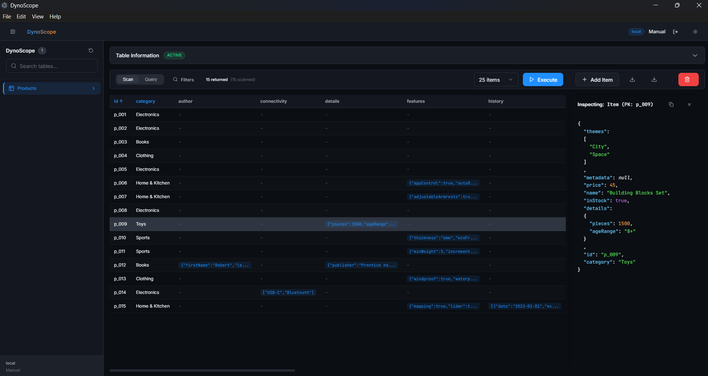

<p align="center">
  
</p>

<h1 align="center">DynoScope</h1>

<p align="center">
  <strong>A modern, powerful, and beautiful desktop GUI for Amazon DynamoDB.</strong>
</p>

<p align="center">
  
</p>

## ✨ Features

- **🚀 Sleek & Modern UI**: A beautiful, premium interface designed for productivity and ease of use.
- **🔌 Seamless Connections**: Connect to local DynamoDB instances or AWS effortlessly with AWS profile support and manual credentials.
- **📊 Intuitive Data Grid**: View your tables in a powerful data grid with built-in sorting, filtering, and inline JSON previews.
- **🔍 Advanced Inspector**: A slide-out Item Inspector panel to beautifully format and explore complex JSON payloads and arrays.
- **🛠️ Table Management**: Easily create, delete, and manage your DynamoDB tables with real-time sync.
- **⚡ Fast & Responsive**: Built with React, TypeScript, and Electron for native desktop performance.

## 📥 Installation

**DynoScope** provides native installers for both **Windows** and **macOS**.

1. Go to the [Releases Page](https://github.com/siddhantdixit/dynoscope/releases) on GitHub.
2. Download the installer for your operating system:
   - **Windows**: Download the `.exe` setup file.
   - **macOS**: Download the `.dmg` file.
3. Install and run DynoScope!

## 💻 Development

Want to build DynoScope from source?

### Prerequisites
- Node.js (v18 or higher recommended)
- npm or yarn

### Quick Start

```bash
# Clone the repository
git clone https://github.com/siddhantdixit/dynoscope.git

# Navigate to the project directory
cd dynoscope

# Install dependencies
npm install

# Run the app in development mode
npm run dev
```

### Build for Production

```bash
# Build the application
npm run build
```

## 🛠️ Tech Stack
- [Electron](https://www.electronjs.org/)
- [React](https://reactjs.org/)
- [Vite](https://vitejs.dev/)
- [TypeScript](https://www.typescriptlang.org/)
- [AWS SDK (DynamoDB)](https://aws.amazon.com/sdk-for-javascript/)

## 📄 License
This project is licensed under the MIT License.
